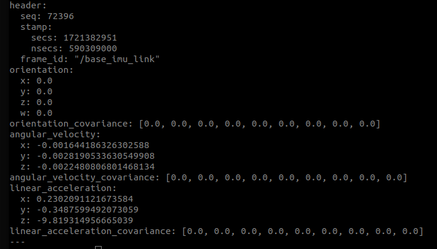

# Multi-Sensor Time Synchronisation System
# 多传感器时间同步系统


## 简介
多传感器的时间同步是一个很重要的问题，尤其对多传感器融合系统。不正确的时间同步会导致数据融合错误，影响系统的性能。
对于大多数研究人员来说，这是一个很底层又复杂的问题，却不是他们的研究方向。
更多的精力应该放在设计传感器融合算法上，而不是在时间同步上。因此，我们设计了一个这样一个系统，让时间同步不再是一件难事。

## 如何开始

### 开始之前
你依旧需要一些关于时间同步的基础知识，才能够更好的使用这个系统。
幸运的是，我们将必要的相关知识整理到了[这里](./assets/时间同步原理.md)。

### 硬件准备
准备全功能时间同步版或时间同步核心板，连接好需要同步的传感器和电源。硬件接口的定义如下：

全功能时间同步板：


时间同步核心板：


按照上图的定义，将传感器的同步信号连接到板子上的对应接口，然后连接电源。

如下是一个同步线连接的参考示例


### 烧入固件

在Firmware文件夹下，有mini_xx.uf2文件和full_xx.uf2文件，分别对应最小功能固件和全功能固件。
将对应的uf2文件下载，然后将板子连接通过Type-C线连接到电脑上，按住板子上的BOOT按键，然后按一下RESET按键，然后松开BOOT按键，这时候板子会进入BOOT模式，弹出一个虚拟U盘。
然后将uf2文件拖到板子的U盘中，等待固件烧入完成。

### 运行程序

#### 权限设置
将Type-C线连接到Linux系统上，检测到串口设备后，需要设置权限，使用如下命令：

```shell
sudo chmod 777 /dev/ttyACM0
```

#### 运行ROS示例程序

如果你的相机设备是海康、大恒或者大华等相机，无论是USB3.0接口或者网口接口，那么我们的SDK将自动检测相机数量然后读取图片信息并以ROS消息的格式发布出来。
如果是其他的相机系统，由于相机时间计算较为复杂，则需要参考高级功能中**自定义相机型号**，自行编写相机读取代码以及时间计算代码。

假设你的设备是海康、大恒或者大华等相机，运行程序之前请接好设备并按如下操作运行程序。

克隆代码
```shell
git clone https://github.com/linyicheng1/Multi-Sensor-Time-Synchronisation-System.git
```

编译代码, 如果是全功能时间同步板
```shell
cd Demo/Demo
mkdir build
cd build
cmake ..
make -j8
```

如果是时间同步核心板
```shell
cd Demo/MINI_demo
mkdir build
cd build
cmake ..
make -j8
```

运行代码，如果是全功能时间同步板
```shell
./synchronisation_ros_node
```

运行代码，如果是时间同步核心板
```shell
./MINI_ros_node
```

正常运行则可以通过`rostopic list`的方法得到传感器信息

进一步的可以通过`rostopic echo /imu`查看IMU数据



### 高级功能

#### 网口通信同步
全功能时间同步板提供了一个百兆网口，能够更高效、更准确的进行时间同步。网口提供了更快的数据传输速度和更加稳定的通讯质量，在实现网口传输数据的同时，还额外加入精简版的PTP对时协议<https://en.wikipedia.org/wiki/Precision_Time_Protocol>，从而实现了与主机时间同步，进而传感器数据采集时间与主机时间一致。
如果要使用网口通信功能则需要按如下步骤进行。

#### 配置参数
全功能时间同步板出厂的默认IP地址为192.168.1.188端口号为8888。为了方便用户自定义组网。可通过以下方式配置同步板的IP地址与端口。
IP设置：
例如：设置网络IP号为192.168.192.188，使用Typc连接线连接同步板和电脑，安装任意版本的串口助手，串口助手发送以下数数据给同步板：
```
IP192.168.192.188
```
端口设置：
例如：设置网络端口号为8888，串口助手发送以下数数据：
```
IO8888
```
时间同步核心板与全功能时间同步板都支持更改相机触发帧率。默认多相机之间与多相机与IMU的同步帧率为25HZ，自定义帧率可通过以下方式进行配置。目前最大同步帧率为400HZ。最大相机同步帧率与相机性能有关，过高的同步帧率会造成相机丢帧。日常使用中建议25HZ。
相机帧率设置：
例如：设置相机帧率为25HZ，串口助手发送以下数数据：
```
HZ25
```
上述所有设置后，需要重新上电重启，或者按下Reset按键等待系统重启。

PTP同步只有在全功能时间同步板中才会启用，启动方式使用UDP协议开启数据传输即可。在代码中可以按照以下方式打开：
```c++
 // 开启数据传输和PTP同步
 auto udp_manager = std::make_shared<UdpManager>("192.168.192.168", 8888);
 udp_manager->Start();
 // 关闭数据传输和PTP同步 
 udp_manager->Stop();
```
### 自定义相机型号

如果使用的相机型号不是指定厂商的，那么需要自己进行一定的开发。在`Demo/CustomisedCamera`文件夹下有一个示例代码，可以参考这个示例代码进行开发。
这里简单介绍一下开发步骤：

1. 新建头文件和源文件，例如 `customised_camera.h` 和 `customised_camera.cpp`。
2. 在头文件中定义一个类，例如`CustCamManger`，定义如下的接口函数

```c++
#pragma once
#include <vector>
#include <thread>

class CustCamManger {
public:
    static CustCamManger& GetInstance() {
        static CustCamManger instance;
        return instance;
    }
    CustCamManger(const CustCamManger&) = delete;
    CustCamManger& operator=(const CustCamManger&) = delete;

     // 初始化相机函数
    bool Initialization();
    // 停止相机读取线程函数
    void Stop();
    // 开始相机读取线程函数
    void Start();
    // 启用相机函数
    void Enable() { is_running_ = true; }
    // 禁用相机函数
    void Disable() { is_running_ = false; }
    // 相机线程，读取相机数据
    void Receive(const std::string&) const;

private:

    CustCamManger();
    ~CustCamManger();
    // 相机线程向量，一个相机一个线程读取
    std::vector<std::thread> cam_threads_;
    // 是否正在运行标志位
    bool is_running_{false};
};
```

3. 在源文件中实现这些函数，其中关键点在于实现如下几个关键部分：
   1. 初始化相机线程，一个相机一个线程
   2. 结束相机线程，关闭相机
   3. 相机读取线程函数，读取相机图像数据，曝光数据，计算时间戳，存入DataManger

如下是一个示例代码：
```c++
// 根据相机数量，构造对应数量的线程，读取相机
void CustCamManger::Start() {
    // 假设有两个相机
    const std::string cam1 = "cam1";
    const std::string cam2 = "cam2";
    cam_threads_.emplace_back(&CustCamManger::Receive, this, cam1);
    cam_threads_.emplace_back(&CustCamManger::Receive, this, cam2);
    Enable();
}

void CustCamManger::Stop() {
    // 1. 关闭相机线程
    Disable();
    std::this_thread::sleep_for(std::chrono::milliseconds{500});
    for (auto &cam_thread : cam_threads_) {
        while (cam_thread.joinable()) {
            cam_thread.join();
        }
    }
    cam_threads_.clear();
    cam_threads_.shrink_to_fit();
    // 2. 关闭相机, 自定义相机关闭
}

// 相机读取线程函数
void CustCamManger::Receive(const std::string &name) const {
    ImgData img_data;
    while (is_running_) {
        // 1. 自定义相机获取图像数据
        // 2. 将图像数据存入img_data TODO
        // 3. 自定义相机获取曝光时间
        float expose_time_us = 0;
        // 4. 将曝光时间存入img_data t = t_trigger + t_expose / 2
        img_data.time_stamp_us = DataManger::GetInstance().GetLastTiggerTime() + static_cast<uint64_t>(expose_time_us / 2.);
        // 5. 设置相机名字
        img_data.camera_name = name;
        // 6. 将img_data存入DataManger
        DataManger::GetInstance().AddCamData(name, img_data);
        std::this_thread::sleep_for(std::chrono::milliseconds{10});
    }
}
```
如果手中没有相机，需要购买相机或者镜头，以及搭建自己的多相机模组，我们这里有恰好有一些建议：[这里](./assets/相机购买指南.md)。
如果手中没有雷达，需要雷达，以及搭建自己的基于雷达的多传感器融合模组，我们这里建议选择支持PPS秒脉冲同步功能的雷达设备。

### 购买链接
【淘宝】Access denied MF3543 「多相机IMU同步板网口串口同步工业相机六轴姿态」
点击链接直接打开 或者 淘宝搜索直接打开


[//]: # (![photo]&#40;./assets/img4.png&#41;)


