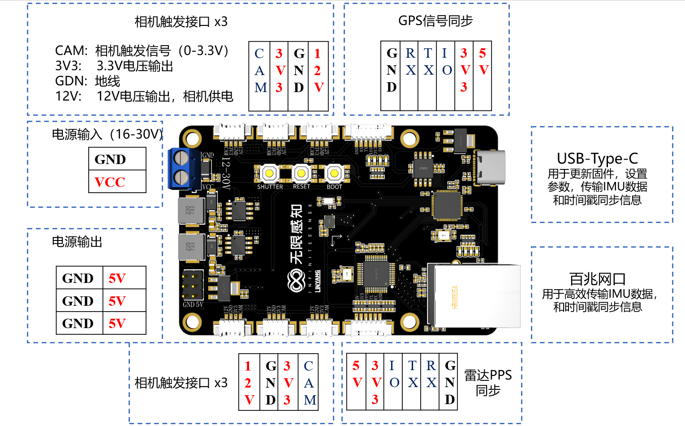

# Multi-Sensor Time Synchronisation System


## 简介
多传感器的时间同步是一个很重要的问题，尤其对多传感器融合系统。不正确的时间同步会导致数据融合错误，影响系统的性能。
对于大多数研究人员来说，这是一个很底层又复杂的问题，却不是他们的研究方向。
更多的精力应该放在设计传感器融合算法上，而不是在时间同步上。因此，我们设计了一个这样一个系统，让时间同步不再是一件难事。

## 如何开始

### 开始之前
你依旧需要一些关于时间同步的基础知识，才能够更好的使用这个系统。
幸运的是，我们将必要的相关知识整理到了[这里](./docs/TimeSync.md)。

### 硬件准备
准备全功能时间同步版或时间同步核心板，连接好需要同步的传感器和电源。硬件接口的定义如下：

全功能时间同步板：



时间同步核心板：


按照上图的定义，将传感器的同步信号连接到板子上的对应接口，然后连接电源。

### 烧入固件

在Firmware文件夹下，有mini_xx.uf2文件和full_xx.uf2文件，分别对应最小功能固件和全功能固件。
将对应的uf2文件下载，然后将板子连接通过Type-C线连接到电脑上，按住板子上的BOOT按键，然后按一下RESET按键，然后松开BOOT按键，这时候板子会进入BOOT模式，弹出一个虚拟U盘。
然后将uf2文件拖到板子的U盘中，等待固件烧入完成。

### 运行程序

#### 权限设置
将Type-C线连接到Linux系统上，检测到串口设备后，需要设置权限，使用如下命令：

```shell
sudo chmod 777 /dev/ttyACM0
```

#### 运行软件


### 高级功能

