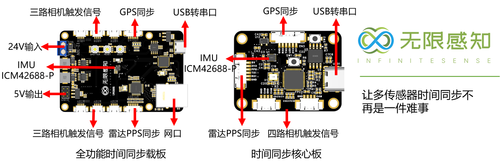
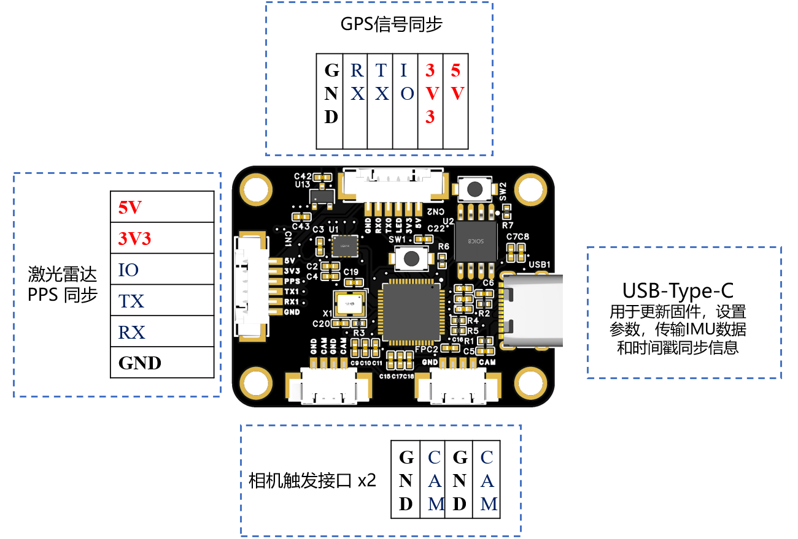

# Multi-Sensor Time Synchronisation System



## 简介
多传感器的时间同步是一个很重要的问题，尤其对多传感器融合系统。不正确的时间同步会导致数据融合错误，影响系统的性能。
对于大多数研究人员来说，这是一个很底层又复杂的问题，却不是他们的研究方向。
更多的精力应该放在设计传感器融合算法上，而不是在时间同步上。因此，我们设计了一个这样一个系统，让时间同步不再是一件难事。

## 如何开始

### 开始之前
你依旧需要一些关于时间同步的基础知识，才能够更好的使用这个系统。
幸运的是，我们将必要的相关知识整理到了[这里](./assets/时间同步原理.md)。

### 硬件准备
准备全功能时间同步版或时间同步核心板，连接好需要同步的传感器和电源。硬件接口的定义如下：

全功能时间同步板：


时间同步核心板：



按照上图的定义，将传感器的同步信号连接到板子上的对应接口，然后连接电源。

如下是一个同步线连接的参考示例


### 烧入固件

在Firmware文件夹下，有mini_xx.uf2文件和full_xx.uf2文件，分别对应最小功能固件和全功能固件。
将对应的uf2文件下载，然后将板子连接通过Type-C线连接到电脑上，按住板子上的BOOT按键，然后按一下RESET按键，然后松开BOOT按键，这时候板子会进入BOOT模式，弹出一个虚拟U盘。
然后将uf2文件拖到板子的U盘中，等待固件烧入完成。

### 运行程序

#### 权限设置
将Type-C线连接到Linux系统上，检测到串口设备后，需要设置权限，使用如下命令：

```shell
sudo chmod 777 /dev/ttyACM0
```

#### 运行ROS示例程序

如果你的相机设备是海康、大恒或者大华等相机，无论是USB3.0接口或者网口接口，那么我们的SDK将自动检测相机数量然后读取图片信息并以ROS消息的格式发布出来。
如果是其他的相机系统，由于相机时间计算较为复杂，则需要参考高级功能中**自定义相机型号**，自行编写相机读取代码以及时间计算代码。

假设你的设备是海康、大恒或者大华等相机，运行程序之前请接好设备并按如下操作运行程序。

克隆代码
```shell
git clone https://github.com/linyicheng1/Multi-Sensor-Time-Synchronisation-System.git
```

编译代码, 如果是全功能时间同步板
```shell
cd Demo/Demo
mkdir build
cd build
cmake ..
make -j8
```

如果是时间同步核心板
```shell
cd Demo/MINI_demo
mkdir build
cd build
cmake ..
make -j8
```

运行代码，如果是全功能时间同步板
```shell
./synchronisation_ros_node
```

运行代码，如果是时间同步核心板
```shell
./MINI_ros_node
```

正常运行则可以通过`rostopic list`的方法得到传感器信息

进一步的可以通过`rostopic echo /imu`查看IMU数据


### 高级功能

#### 使用网口通信
全功能时间同步板提供了一个百兆网口，能够更高效、更准确的进行时间同步，如果要使用网口通信功能则需要按如下步骤进行。


#### 配置参数


#### 自定义相机型号

如果使用的相机型号不是指定厂商的，那么需要自己进行一定的开发。

